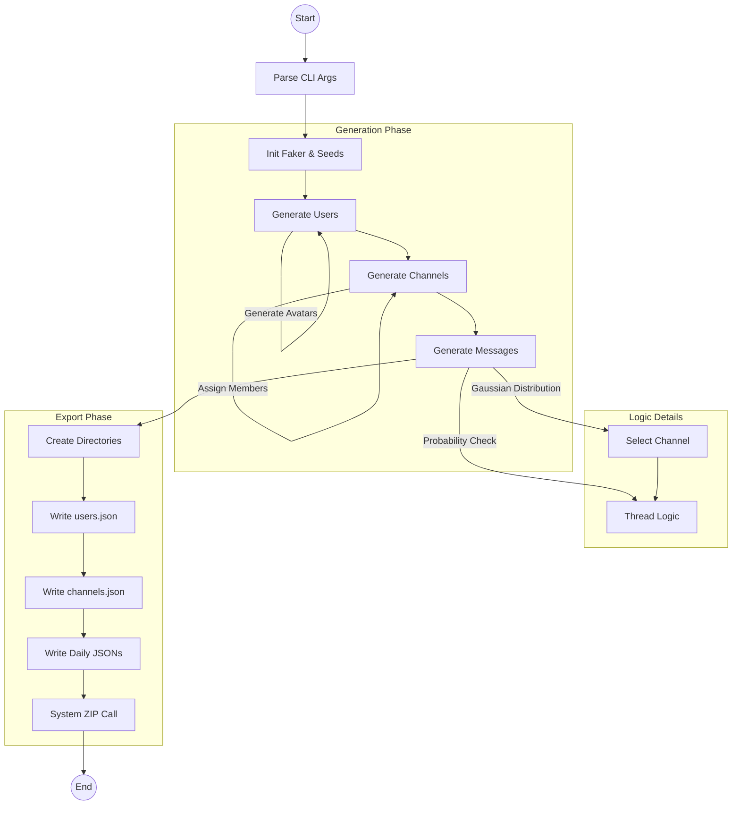

# Architecture & Design

## 1. Overview
`syngen` is a modular C99 CLI utility designed to generate synthetic Slack export data. It mimics the internal structure of Slack's zipped JSON exports, populating them with realistic data distributions and relationships.

## 2. Data Schemas
The application models three primary entities based on the Slack Export format:

### 2.1. User (`users.json`)
Represents a workspace member.
-   **Core**: `id` (U...), `name` (username), `real_name`.
-   **Profile**: `email`, `avatar_hash` (random hex), and a full set of Gravatar URLs (`image_24` through `image_1024`).
-   **Role**: `is_admin`, `is_bot`.

### 2.2. Channel (`channels.json`)
Represents a public channel.
-   **Core**: `id` (C...), `name` (random word pair), `created` timestamp.
-   **Membership**: `creator` (User ID) and a list of `members` (User IDs).

### 2.3. Message (Daily JSON files)
Represents a chat message or a thread reply.
-   **Standard**: `user` (ID), `text` (Lorem Ipsum), `ts` (timestamp).
-   **Threading**:
    -   **Parent**: Contains `thread_ts` (== `ts`), `reply_count`, `reply_users`, and a `replies` array.
    -   **Child**: Contains `thread_ts` (pointing to parent) and `parent_user_id`.

## 3. Application Flow

The application follows a linear generation pipeline:

## 4. Key Algorithms

### 4.1. Message Distribution
To simulate realistic activity, `syngen` uses a **Gaussian (Normal) Distribution** to select channels for new messages. This ensures that a few channels ("general", "random") receive the bulk of the traffic, while others remain quieter.

### 4.2. Threading Model
The generator maintains a state of "Active Threads" per channel.
1.  **New Message**:
    -   **10% Chance** (configurable): Reply to an existing active thread.
    -   **90% Chance**: Create a new top-level message.
2.  **Thread Creation**:
    -   Top-level messages have a ~20% probability of becoming an "Active Thread" that accepts future replies.
3.  **Constraints**: Replies must occur chronologically after the parent message and within a reasonable time window (3 days).

## 5. Module Structure

| Module | Description | Dependencies |
| :--- | :--- | :--- |
| **Main** | Entry point, argument parsing, orchestration. | All modules |
| **Faker** | Data generation (Names, Text, IDs) using static arrays. | None |
| **Generator** | Business logic, struct allocation, distribution math. | Faker, Models |
| **Export** | Serialization (cJSON), file I/O, Directory management. | cJSON, Models |
| **cJSON** | Lightweight JSON serializer (Vendor). | None |
